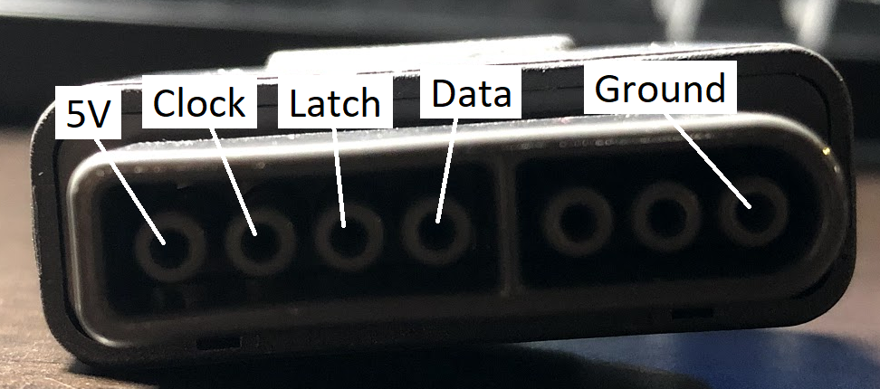

# Arduino SNES Controller Library

Se trata de una librería que permite conectar mandos de SNES a un Arduino.

El autor original de esta librería se basó en un sketch encontrado en Hackaday.io (https://hackaday.io/project/7498-snes-controller-arduino-adapter).

Para su instalación basta con copiarlo a ~/Arduino/libraries

## Cableado
El conector del controlador SNES tiene 7 pines, de los cuales se utilizan 5 (ver figura). El mejor modo de conectarlo es mediante un conector hembra fácilmente encontrable en Internet.



## Example Usage
```cpp
#include <SNES.h>

// SNES controller with data on pin 7, data on pin 9, latch on pin 8
SNESController snes(7, 9, 8);

void setup() {
	Serial.begin(115200);

	// initialize SNES controller
	snes.initialize();

	// buttons are longs
	long btn = SNES_B_BUTTON;
}

void loop() {

	delay(1000);

	// read controller buttons
	snes.update();


	// check inputs with pressed, andPressed, orPressed

	if (snes.pressed(SNES_A_BUTTON))
		Serial.println("A");

	if (snes.andPressed(new long[2]{SNES_L_BUTTON, SNES_R_BUTTON}))
		Serial.println("L + R");

	if (snes.orPressed(new long[4]{SNES_DPAD_UP, SNES_DPAD_DOWN, SNES_DPAD_LEFT, SNES_DPAD_RIGHT}))
		Serial.println("D-pad");


	// or work with the data in binary form if you prefer that

	uint16_t data = snes.getData();

	if (data & SNES_START_BUTTON)
		Serial.println("Start");
}
```
